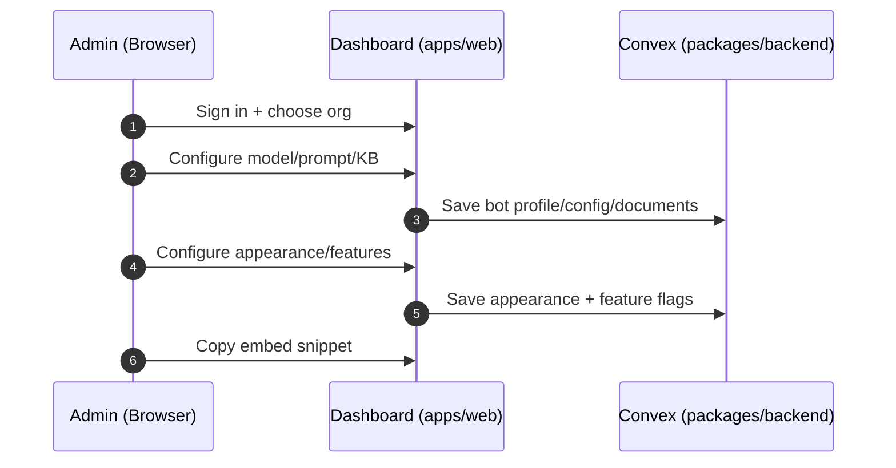
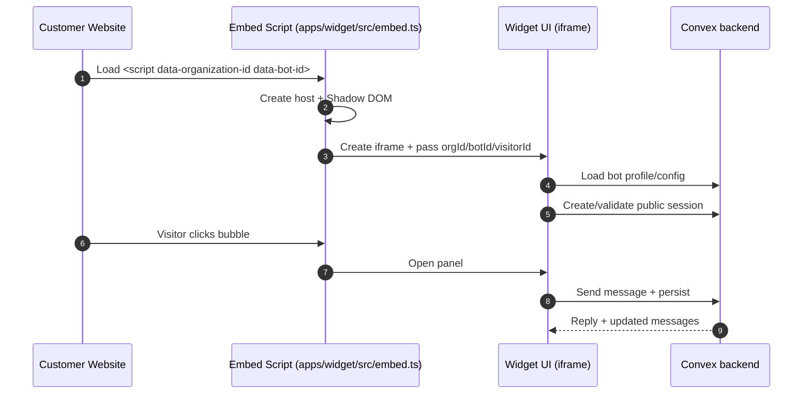

# Chatify — App Features & Flow

This document is a **single, skimmable overview** of what Chatify does, what features exist in this repo, and the main end-to-end flows (Admin → Configure → Deploy → Visitor chat → Monitor).

---

## 1) What is Chatify?

Chatify is a **multi-tenant AI webchat platform**:

- **Admins** use a dashboard to configure an AI agent (model/provider, prompt, knowledge base, appearance, features).
- **Customers** embed a lightweight script into any website to show a **chat bubble + chat panel**.
- **Visitors** can chat without login (public sessions) while the system stores conversations/messages and can stream AI responses.

---

## 2) Repo structure (what each part is responsible for)

- Dashboard app (Admin UI):
  - [apps/web](apps/web)
- Widget runtime (embedded into external websites):
  - [apps/widget](apps/widget)
- Backend (Convex schema + server functions):
  - [packages/backend](packages/backend)
- Shared UI components (shadcn/radix + Tailwind tokens):
  - [packages/ui](packages/ui)

Key reference docs:

- System overview: [SYSTEM_OVERVIEW.md](SYSTEM_OVERVIEW.md)
- Phase delivery summary: [PHASE-2-DELIVERY-SUMMARY.md](PHASE-2-DELIVERY-SUMMARY.md)
- Architecture audit: [ARCHITECTURE-AUDIT-SUMMARY.md](ARCHITECTURE-AUDIT-SUMMARY.md)

---

## 3) Core features (what the app can do)

### A) Admin dashboard features (apps/web)

Dashboard routes live under [apps/web/app/dashboard](apps/web/app/dashboard):

- Overview page (high-level landing)
  - [apps/web/app/dashboard/overview](apps/web/app/dashboard/overview)
- Monitor (observe what’s happening)
  - Conversations list/details: [apps/web/app/dashboard/monitor/conversations](apps/web/app/dashboard/monitor/conversations)
  - Users list/details: [apps/web/app/dashboard/monitor/users](apps/web/app/dashboard/monitor/users)
- Configurations (agent “brain”)
  - Model/provider selection + API key presence
  - System prompt / instructions
  - Knowledge base management and analytics
  - Lead capture / escalation settings (WhatsApp/email)
  - Main page: [apps/web/app/dashboard/configurations/page.tsx](apps/web/app/dashboard/configurations/page.tsx)
- Webchat (agent “face”)
  - Bot profile: [apps/web/app/dashboard/webchat/bot-profile](apps/web/app/dashboard/webchat/bot-profile)
  - Appearance (theme/font/header/message styles, radius): [apps/web/app/dashboard/webchat/bot-appearance](apps/web/app/dashboard/webchat/bot-appearance)
  - Feature toggles (feedback/file upload/sound/etc): [apps/web/app/dashboard/webchat/features](apps/web/app/dashboard/webchat/features)
  - Deploy settings (embed setup): [apps/web/app/dashboard/webchat/deploy-settings](apps/web/app/dashboard/webchat/deploy-settings)
- Integrations (currently UI surfaces / stubs)
  - WhatsApp: [apps/web/app/dashboard/integrations/whatsapp](apps/web/app/dashboard/integrations/whatsapp)
  - Instagram: [apps/web/app/dashboard/integrations/instagram](apps/web/app/dashboard/integrations/instagram)
  - Omnichannel: [apps/web/app/dashboard/integrations/omnichannel](apps/web/app/dashboard/integrations/omnichannel)
- Settings (account and organization context)
  - Profile: [apps/web/app/dashboard/settings/profile](apps/web/app/dashboard/settings/profile)
  - Billing: [apps/web/app/dashboard/settings/billing](apps/web/app/dashboard/settings/billing)
  - General: [apps/web/app/dashboard/settings/general](apps/web/app/dashboard/settings/general)

Other useful admin tooling:

- Widget demo/testing page: [apps/web/app/widget-demo](apps/web/app/widget-demo)
- Streaming chat API route (SSE): [apps/web/app/api/chat/stream/route.ts](apps/web/app/api/chat/stream/route.ts)

### B) Embedded widget features (apps/widget)

The widget has two parts:

1. **Embed script** (what customers paste into their website)

- Source: [apps/widget/src/embed.ts](apps/widget/src/embed.ts)
- Responsibilities:
  - Read required attributes: `data-organization-id`, `data-bot-id`
  - Create a fixed-position host with **0x0 layout impact**
  - Use **Shadow DOM + defensive CSS** to avoid site CSS conflicts
  - Create an **iframe** that loads the widget UI from the widget app
  - Create and persist a `visitorId` in localStorage with TTL (resets daily UTC)
  - Manage open/close state (bubble ↔ panel)

2. **Widget UI app** (runs inside the iframe)

- Lives in [apps/widget](apps/widget) (Next.js App Router)
- Responsibilities:
  - Fetch bot configuration (name/color/etc)
  - Create/validate a public chat session
  - Send messages and display chat history
  - Keep launcher/container theme in sync (via postMessage from iframe → embed)

Key widget runtime entry point:

- Widget page: [apps/widget/app/widget/page.tsx](apps/widget/app/widget/page.tsx)
- postMessage bridge: [apps/widget/lib/postmessage-bridge.ts](apps/widget/lib/postmessage-bridge.ts)

### C) Backend/data features (packages/backend)

Convex schema defines the main entities (packages/backend/convex/schema.ts):

- Schema: [packages/backend/convex/schema.ts](packages/backend/convex/schema.ts)

- botProfiles: bot config, model config, appearance, feature flags, embed token, escalation
- conversations: chat sessions (supports both authenticated participants and public visitors)
- messages: chat messages for each conversation
- documents: knowledge base chunks + embeddings + vector index
- aiLogs: AI response logs/metrics
- publicSessions: stateless public session validation for widget visitors
- businessEvents: lead-click events (WhatsApp/email)

Knowledge base is designed for retrieval-augmented generation (RAG):

- documents table stores `text` + `embedding[]`
- vector index: `by_embedding` (dimensions: 3072)

---

## 4) Key user flows (end-to-end)

### Flow 1 — Admin configures a bot

1. Admin signs in (Clerk) and selects an Organization context
2. Admin opens Dashboard → Configurations
3. Admin sets:
   - Model/provider (and API key presence)
   - System prompt / instructions
   - Knowledge base documents
   - Escalation options (optional)
4. Admin opens Dashboard → Webchat
5. Admin customizes:
   - Bot profile (name/avatar/description)
   - Appearance (colors, theme mode, font, radius)
   - Feature toggles
6. Admin copies the embed script snippet (Deploy settings) and installs it on a website

Mermaid (high-level):

### Flow 2 — Visitor uses the widget on a customer website (no login)

1. Customer website loads the embed script
2. Embed script:
   - reads orgId/botId
   - generates/persists visitorId
   - creates host + Shadow DOM
   - creates iframe to widget UI
3. Widget UI loads:
   - fetches bot profile/config
   - creates/validates a public session (publicSessions)
4. Visitor sends a message
5. System stores message and generates AI reply (optionally streaming)
6. Visitor sees responses in real time; messages are persisted for monitoring/analytics

Mermaid (high-level):

### Flow 3 — Admin monitors conversations and users

1. Admin opens Dashboard → Monitor
2. Monitor pages subscribe/read from Convex for:
   - Conversations (by bot/org)
   - Users/visitors (activity)
3. Admin can inspect message history and AI behavior (via logs/analytics where exposed)

---

## 5) What’s implemented vs what’s “surface/stub”

Implemented in this repo today:

- Dashboard pages for bot configuration, knowledge base, appearance, and monitoring
- Embedded widget script and widget app scaffolding
- Convex schema for multi-tenant chat + KB (vector search ready)
- Public session design for visitor chats
- Widget streaming via Convex action (messages update as tokens are produced)
- Streaming endpoint in apps/web (SSE) for chat streaming route usage
- Widget demo/testing page

Present but may be incomplete or depend on environment/config:

- Full production deployment (requires proper Clerk + Convex + provider keys)
- Some integration pages (WhatsApp/Instagram/Omnichannel) are primarily UI placeholders

If you’re preparing for launch, review:

- [ARCHITECTURE-AUDIT-SUMMARY.md](ARCHITECTURE-AUDIT-SUMMARY.md) (blockers + launch readiness)

---

## 6) “Where do I start?” (fast pointers)

If you want to understand behavior quickly, read these in order:

1. [SYSTEM_OVERVIEW.md](SYSTEM_OVERVIEW.md) (product + architecture)
2. [packages/backend/convex/schema.ts](packages/backend/convex/schema.ts) (data model)
3. [apps/widget/src/embed.ts](apps/widget/src/embed.ts) (how embedding works)
4. [apps/widget/app/widget/page.tsx](apps/widget/app/widget/page.tsx) (public session + messaging)
5. [apps/web/app/dashboard/configurations/page.tsx](apps/web/app/dashboard/configurations/page.tsx) (model + KB + prompt)
6. [apps/web/app/dashboard/webchat](apps/web/app/dashboard/webchat) (profile/appearance/deploy)

---

## 7) Glossary

- Org / Organization: tenant boundary (Clerk Organizations)
- Bot profile: config object for a chatbot (appearance + model config + features)
- Public session: visitor’s chat access without login, validated server-side
- RAG: retrieval-augmented generation (use knowledge base docs as context)
- SSE streaming: server-sent events for incremental “typing” responses
